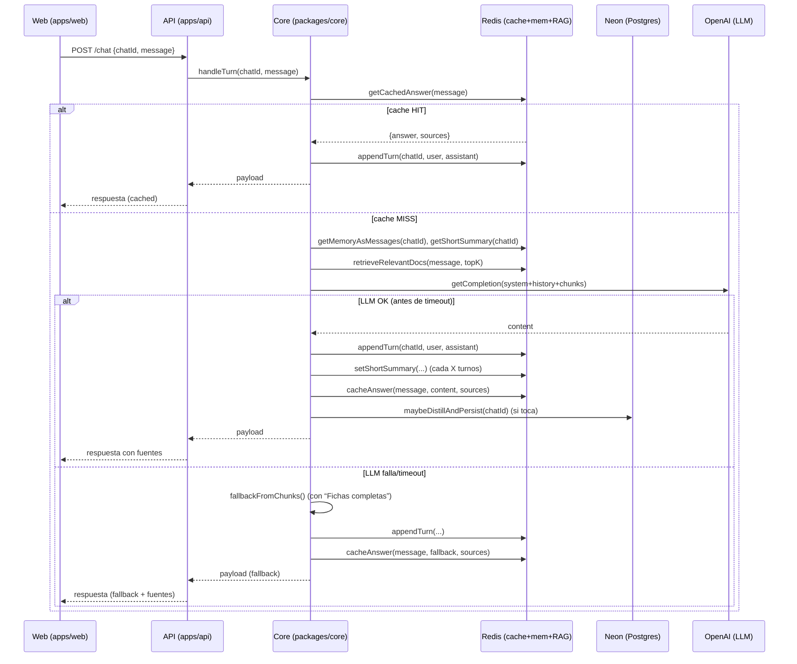

# Visión general

* **Frontend (web)** crea un `chatId` en `localStorage` y llama `POST /chat`.
* **API** delega en `packages/core` → orquesta **cache → memoria → retriever (RAG/Redis) → LLM (OpenAI)** con *fallback*.
* **Persistencia**:

  * **Redis**: historial corto por chat + resumen corto + caché de respuestas.
  * **Neon (Postgres)**: resumen **largo** destilado cada N turnos (y pronto: *telemetría + mensajes* para auditoría).

# Diagrama de flujo (secuencia)

# Qué hace cada paquete

## `apps/web`

* Genera `chatId` (`web-<timestamp>-<rand>`) y lo guarda en `localStorage`.
* Envía `POST /chat` y renderiza los mensajes.
* **Fuentes**: mostradas como **acordeón** (URLs limpias/clicables).
* Indicador de escritura + scroll automático.

## `apps/api`

* `server.ts` expone `POST /chat` y llama a `handleTurn(...)` (core).
* Carga `.env` (con el *boot* que apunta al **.env raíz**).
* CORS + rate limit.

## `packages/core`

Orquesta **todo** en `handleTurn`:

1. **Cache** (Redis)
   `getCachedAnswer(message)` → si hay *hit*, devuelve al momento y **persiste el turno** igualmente.

2. **Memoria** (Redis)

   * `getMemoryAsMessages(chatId)` → historial reciente (user/assistant).
   * `getShortSummary(chatId)` → priming del LLM.

3. **Retriever (RAG)**

   * `retrieveRelevantDocs(message, topK)` (Redis / RediSearch).
   * Devuelve docs con `{titulo, descripcion, url, ...}`.

4. **LLM (OpenAI)**

   * Construye `messages` con: **system** + `shortSummary` + (si no hay historial) `longSummary` (Neon) + `history` + **chunks** RAG (podados por tamaño/cantidad).
   * Llama a `chat.completions.create`.
   * **Timeout controlado** por `CORE_LLM_TIMEOUT_MS`.

5. **Fallback** si falla el LLM (timeout/error)

   * Genera respuesta **sin LLM** con:

     * Lista de recursos del RAG (título + URL + breve).
     * Bloque **“### Fichas completas”**: una ficha por cada ayuda, con campos pedidos en el *system prompt* (rellenando con `N/D` si faltan datos).
   * Fuentes: mismas URLs de RAG.

6. **Persistencia & housekeeping**

   * **Redis**:

     * `appendTurn(chatId, userMsg, assistantMsg, {sources})` → historial corto por chat.
     * `setShortSummary` cada `UPDATE_SHORT_SUMMARY_EVERY_TURNS`.
     * `cacheAnswer(message, content, { model, sources })`.
   * **Neon**:

     * `maybeDistillAndPersist(chatId)` → si el hilo supera el umbral (**`2 × DISTILL_EVERY_TURNS`** mensajes), destila **resumen largo** y hace `upsert`.
   * Log/latencias (si `CORE_VERBOSE=1`).

## `packages/llm`

* `buildMessages(...)`: compone el *prompt* con todas las piezas (system, resúmenes, historial y chunks).
* `getCompletion(...)`: aplica **knobs** de LLM (max tokens, temperatura, poda de historial y chunks) y llama a OpenAI.
* `maybeDistillAndPersist(...)`: usa el LLM para crear **resumen largo** y guardarlo en Neon.

## `packages/retriever`

* Busca en Redis (RediSearch) los **documentos “ayuda”** previamente inges­tados (título/descr./URL + campos estructurados).
* Devuelve top-K documentos relevantes.

## `packages/memory`

* **Redis**: `chat:<chatId>:messages`, `chat:<chatId>:summary_short`.
* **Neon**: tabla/respaldo para **resumen largo** (y próximamente, mensajes + telemetría).

## `packages/cache`

* Caché de respuestas exactas por **texto de entrada** (para *preguntas repetidas*).

# Orquestación en `core`

Orden y *timeouts*:

* **Cache** → **Memoria** → **Retriever** → **LLM** (con timeout `CORE_LLM_TIMEOUT_MS`) → **Persistencia** (Redis + Neon) → **Cache write** → **Return**.

**Si el LLM no responde a tiempo**: devolvemos **fallback** usando **exclusivamente** los chunks de RAG; así el usuario recibe algo **útil y trazable** (con fuentes) siempre.

# Infra & datos

## Redis

* **Levantado con Docker** (Redis + opcional RedisInsight en `localhost:8001`).
* **RAG**: creaste un **índice RediSearch** para los documentos **“ayuda”** (los datos vienen de Neon vía ETL).
* **Memoria/caché**:

  * `chat:<chatId>:messages` → array de turnos (user/assistant).
  * `chat:<chatId>:summary_short` → resumen corto.
  * Cache de respuestas exactas (clave por *hash* del input / texto crudo).

> Consejito: `FT.INFO <index>`, `FT.SEARCH`, `SCAN chat:*` para inspección, y `redis-cli --scan --pattern "chat:*" | xargs -n1 redis-cli DEL` (Linux/macOS) para limpieza. En Windows/PowerShell, usa el bucle con `ForEach-Object` bien formado (sin `redis-cli` dentro del prompt del servidor).

## Neon (Postgres)

* **Ingesta del Excel** a Neon (tabla principal de **ayudas**).
* **ETL** de Neon → **Redis** para acelerar el RAG (se indexa en RediSearch).
* **Memoria larga**: se guarda el **resumen largo** por `chatId` (y más adelante, guardaremos **mensajes y telemetría** para auditoría).

# Esquema actual de datos (lógico)

* **Ayudas (Neon)** → **RAG (Redis/RediSearch)** → *consulta* en tiempo real.
* **Conversación (Redis)**:

  * `messages` por `chatId`.
  * `summary_short` por `chatId`.
  * **Cache** por *input exacto*.
* **Resumen largo (Neon)**:

  * Una fila por `chatId` (actualizada cada destilado).

# Config clave (.env)

* **OPENAI\_API\_KEY**, **DATABASE\_URL** (Neon), **REDIS\_URL**.
* **CHAT\_MODEL** (por defecto `gpt-4o-mini`).
* **RAG/LLM**:

  * `RETRIEVER_TOP_K`
  * `CORE_RETRIEVER_TIMEOUT_MS`
  * `CORE_LLM_TIMEOUT_MS`
  * `LLM_TRIM_HISTORY_TURNS`, `LLM_MAX_CHUNKS`, `LLM_MAX_DESC_CHARS`
  * `LLM_MAX_TOKENS`, `LLM_TEMPERATURE`
  * `UPDATE_SHORT_SUMMARY_EVERY_TURNS`, `DISTILL_EVERY_TURNS`
* **Logs**: `CORE_VERBOSE=1`, `LLM_VERBOSE=1`.

# Qué pasa cuando “falla” el LLM

1. **Se dispara un timeout** (configurado por `CORE_LLM_TIMEOUT_MS`) o error de API.
2. Se construye **`fallbackFromChunks()`**:

   * Lista de ayudas del RAG (título + URL + breve).
   * **“### Fichas completas”** (una por ayuda) con los campos del *system prompt*, rellenando `N/D` si falta información.
3. Se **persiste** igual (Redis + cache), con `model: "fallback"`.
4. El usuario **siempre** ve fuentes y fichas, aun sin LLM.

# Próximo objetivo: **Memoria larga completa en Neon (auditoría/panel)**

Además del resumen largo, guardar **cada turno** y **telemetría** en Neon para:

* Auditar: *qué se preguntó, qué se recuperó, qué se respondió, qué fuentes se citaron*.
* Medir rendimiento: latencias, timeouts, tokens, costes, eficacia del RAG.
* Construir **panel admin** (listas de chats, hilos, fuentes, métricas).

**Tablas mínimas sugeridas**:

* `chats(chat_id, user_id, meta, created_at)`
* `chat_messages(id, chat_id, role, content, sources[], created_at)`
* `retrievals(id, chat_id, turn_index, rank, score, url, titulo, snippet)`
* `llm_turns(id, chat_id, turn_index, model, temperature, latency_ms, timed_out, error, tokens_in, tokens_out, prompt_chars, response_chars, created_at)`
* (ya existe) `memory_summaries(chat_id, summary_long, updated_at)`

**Integración mínima** (pasos):

1. En `appendTurn(...)`: insertar **dos filas** en `chat_messages` (user y assistant).
2. Tras `retrieveRelevantDocs(...)`: insertar filas en `retrievals` (rank/score/url…).
3. Cronometrar LLM, capturar `res.usage` y guardar en `llm_turns`.
4. Mantener `maybeDistillAndPersist(...)` para `memory_summaries`.

**Panel** (MVP):

* Lista de chats (actividad, nº mensajes, %fallback).
* Detalle de conversación con **fuentes** y **retrievals** por turno.
* Métricas: latencia p50/p95, fallback rate, tokens/día, top URLs.

---
